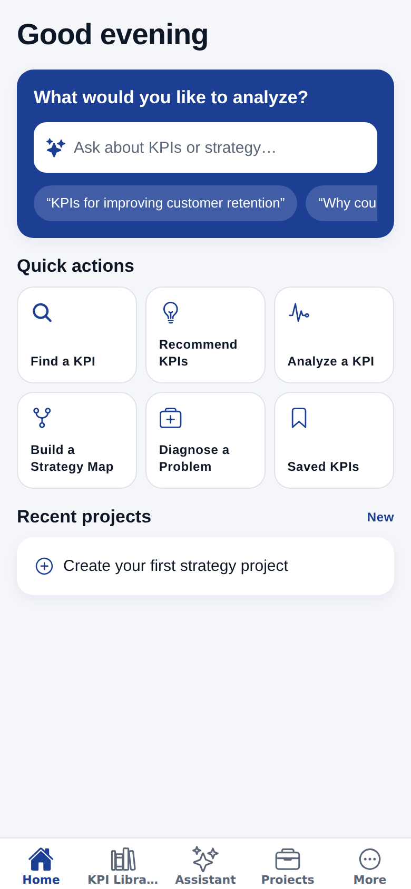
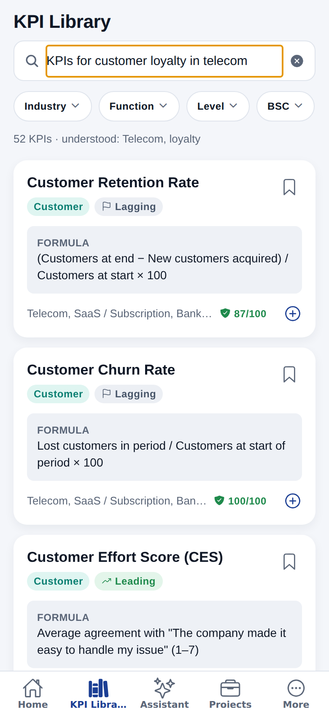
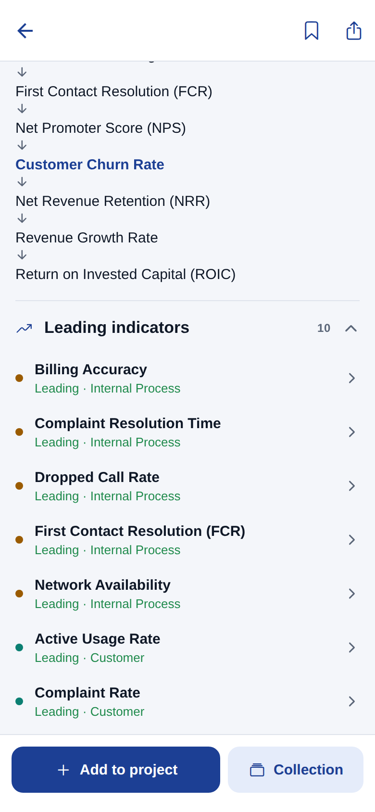
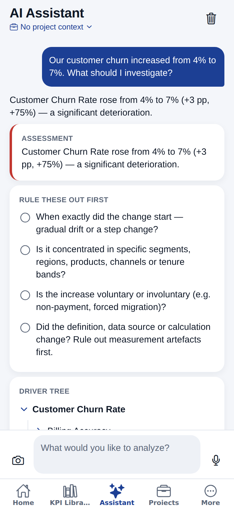
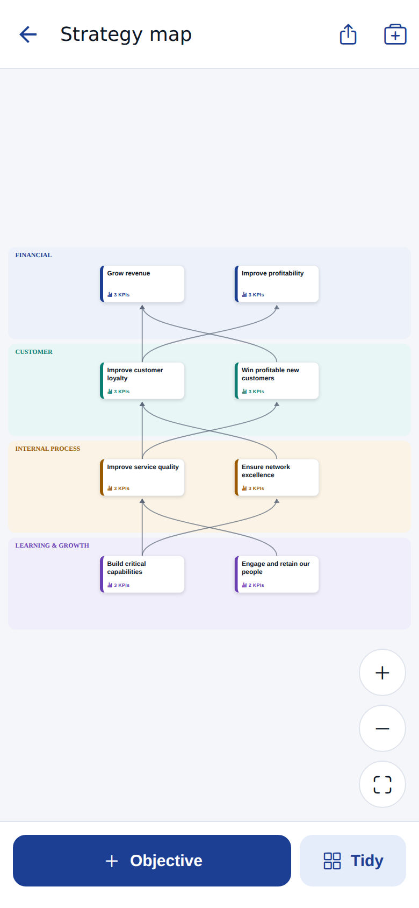
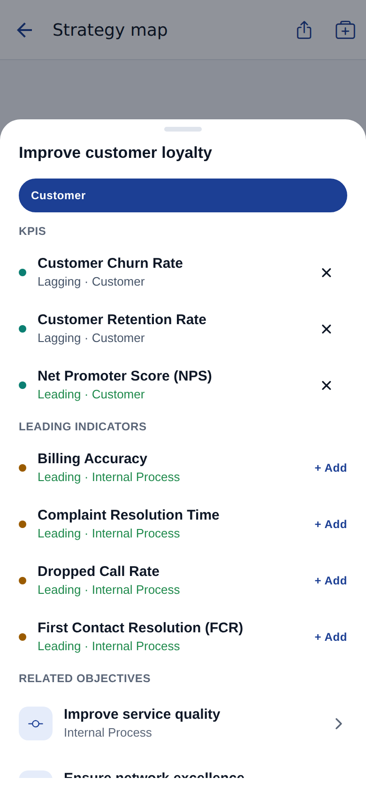
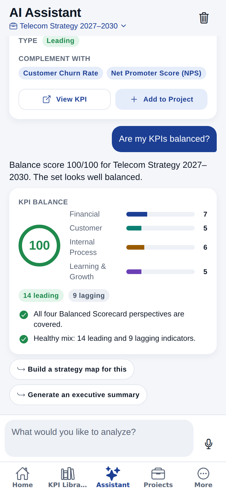
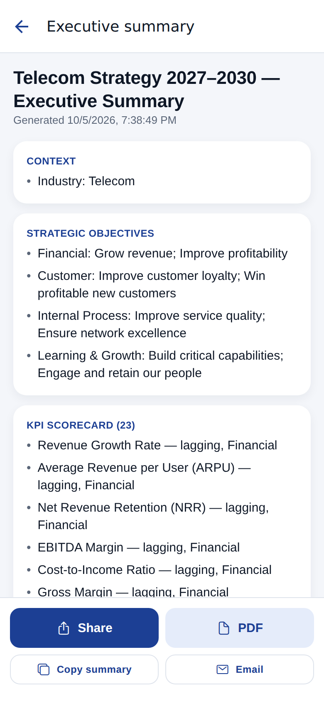
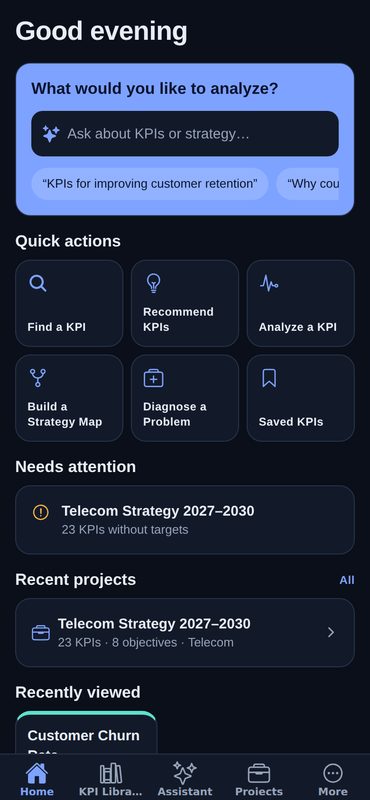

# KPI Consultant (offline Android app)

A local Android app for strategy consultants and managers. You can find and understand KPIs in
seconds, get recommendations and diagnostics, build strategy maps by touch, check whether a KPI set
is balanced, and share an executive summary.

**There is no server, no account and no internet requirement.** The KPI knowledge base, search,
assistant, projects and reports all run and are stored on the phone.

| Home | Search | KPI detail | Diagnosis | Strategy map |
|---|---|---|---|---|
|  |  |  |  |  |

| Objective sheet | Balance check | Executive summary | Dark mode |
|---|---|---|---|
|  |  |  |  |

*The screenshots come from the app's own UI code, rendered at phone size (390×844) during an automated walkthrough with no server running.*

## Get the APK

**Releases (easiest).** Open the repository's **Releases** page and download the
`kpi-consultant-vX.Y.Z.apk` attached to the latest release. Each release lists what changed
(see [CHANGELOG.md](CHANGELOG.md)).

To publish a new release, bump `expo.version` (and `android.versionCode`) in
`apps/mobile/app.json` and add a CHANGELOG section. The next build creates the `vX.Y.Z` tag and the
GitHub Release with the APK attached.

**Option A: GitHub Actions (no setup).** Every push that changes the app runs
[`.github/workflows/android-apk.yml`](.github/workflows/android-apk.yml). Open the repository's
**Actions** tab, select the latest **Build Android APK** run, and download **kpi-consultant-apk**
from *Artifacts*. You can also start it by hand with *Run workflow*. Unzip the artifact, copy
`app-release.apk` to the phone, and open it to install. Android will ask you to allow installs from
that source.

**Option B: build on your computer** (Node 22, JDK 17 and Android Studio/SDK):

```bash
npm install
cd apps/mobile
npx expo prebuild --platform android
cd android && ./gradlew assembleRelease
# → apps/mobile/android/app/build/outputs/apk/release/app-release.apk
```

**Option C: Expo cloud build:** `cd apps/mobile && npx eas-cli build -p android --profile apk`.

> These APKs are signed with the default debug key, which is fine for installing on your own devices.
> For Google Play, create your own release keystore and build the `production` (AAB) profile.

## What works offline

- **KPI Library:** 271 KPIs: 60 fully documented core KPIs (drivers, trade-offs, gaming risks, data
  requirements, benchmarks, sources) plus 211 library entries across business functions and 19
  industries. Natural-language search ("KPIs for customer loyalty in
  telecom") and filters for industry, function, level, BSC perspective, leading/lagging and KPI type.
- **KPI detail:** definition, formula with an example, strategic role, leading and lagging relations,
  drivers, trade-offs, gaming risks, data requirements, benchmarks, sources, quality score, a
  relationship graph and comparison.
- **Assistant:** a rule-based engine on the phone. It recommends balanced KPI sets, explains and
  compares KPIs, diagnoses KPI changes ("churn increased from 4% to 7%") with driver trees, reviews
  balance, drafts strategy maps and gives target-setting guidance.
- **Projects:** a workspace with Overview, Strategy, KPIs, Targets, Initiatives, Diagnostics and
  Reports tabs. The touch strategy map supports pinch, pan, tap, long-press to connect and drag.
- **Sharing:** executive summaries, KPI cards and diagnoses go out through the Android share sheet, as
  a PDF, by copy or by email.
- **Saved KPIs and collections**, light and dark mode.
- **Backup and restore** (Settings): export everything to a JSON file and restore it on any phone.
  Data never leaves the device unless you share or export it.

## Repository layout

```
apps/mobile      Expo / React Native Android app (src/app = screens, src/components, src/state, src/services)
packages/shared  KPI dataset and reasoning engines (search, quality, graph, recommend, balance,
                 diagnose, strategy map, summary, assistant), validation, unit tests
docs/            Architecture, roadmap, design system, screenshots
```

## Development

```bash
npm install
npm test            # engine unit tests
npm run typecheck
npm start           # Expo dev server; press "a" for an Android emulator or device
```

A development build (`cd apps/mobile && npx expo run:android`) loads code from your computer, so it
needs a connection to it. The release APK is self-contained.
